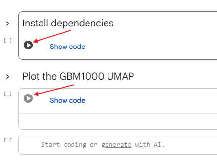

# UMAP plots for the GBM1000

The repository contains a notebook to interactively visualize the data of the GBM1000 dataset. 

## Use in the browser

Try it without any local installation by clicking the badge below:

Click on the play buttons to install dependencies in the cloud* and to obtain the UMAP plot, as depicted below.

**: nothing is installed on your computer*

